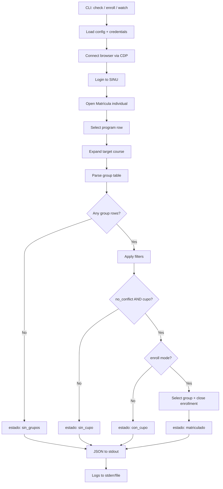
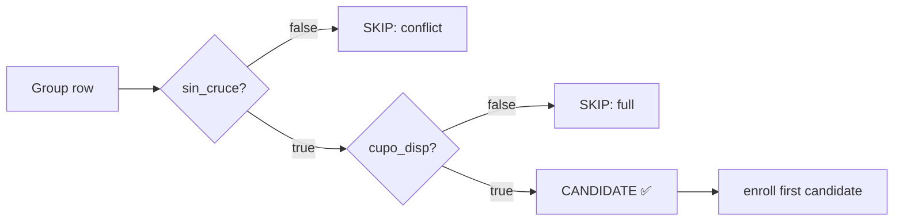

# SINU Auto-Enrollment 🎓

Automated enrollment monitor for **SINU USC** (Universidad Santiago de Cali academic system).

Detects when a course group becomes available (no schedule conflict + open slot) and enrolls automatically — **pure Playwright automation, zero LLM calls**.

 

---

## 🧠 Why

Manually refreshing SINU every few minutes to catch a freed slot in a full course (e.g. *Proyecto Integrador de Grado*) is tedious. This tool does it for you — silently, deterministically, and for **$0.00 in tokens** (see [Cost Analysis](docs/cost-analysis.md)).

## ⚡ Features

- 🔐 **Credentials via `.env`** — never hardcoded
- ⚙️ **Fully configurable** — course code, group prefix, conflict rules
- 🚫 **No LLM dependency** — deterministic automation only
- 🧩 **Two modes**: `check` (read-only) + `enroll` (auto-enroll) + `watch` (loop)
- 📦 **JSON output** — machine-readable for cron/CI/agents
- 🎯 **Conflict-aware** — ignores groups that clash with your fixed schedule
- 📝 **Structured logging** — stderr + optional file, never mixes with JSON output

## 🏗️ How it works



## 📦 Requirements

- Python 3.10+
- Chrome/Chromium (Playwright connects via CDP)

```bash
pip install -r requirements.txt
```

## 🚀 Quick start

### 1. Configure credentials

```bash
cp config/example.env .env
```

```bash
# .env
SINU_USERNAME=your_student_id_here
SINU_PASSWORD=your_password_here
SINU_URL=https://sinu.usc.edu.co:8443/sinugwt/
```

### 2. Check availability (read-only)

```bash
python -m sinu_auto check --config config/settings.yaml --env .env
```

```json
{
  "estado": "sin_cupo",
  "timestamp": "2026-08-03T23:23:33",
  "grupos": [
    {"grupo": "PIG03", "sin_cruce": true,  "cupo_disp": false, "cupo_valor": 0, "horario": "Jueves 18:30 - 21:30"},
    {"grupo": "PIG02", "sin_cruce": false, "cupo_disp": true,  "cupo_valor": 17, "horario": "Martes 18:30 - 21:30"}
  ],
  "candidatos": [],
  "matriculado": null
}
```

### 3. Auto-enroll

```bash
python -m sinu_auto enroll --config config/settings.yaml --env .env
```

### 4. Watch (loop mode)

```bash
python -m sinu_auto watch --config config/settings.yaml --env .env --interval 1800
```

> 💡 **Production pattern:** run `enroll` from a cron job every 30 min. The wrapper script only emits output when there's something to report (see `scripts/sinu_monitor.sh`).

## 📐 Configuration

All behavior lives in `config/settings.yaml`:

```yaml
sinu:
  url: "https://sinu.usc.edu.co:8443/sinugwt/"
  period: "2026B"
  program: "P217"

target:
  course_code: "ISI51"        # course to watch
  group_prefix: "PIG"         # group name prefix
  require_no_conflict: true   # only enroll groups without schedule conflict
  fixed_schedule:             # courses you already have (conflict sources)
    - name: "ECUACIONES DIFERENCIALES"
      days: ["Martes"]
      time: "18:30-21:30"

enroll:
  auto: true                  # enroll when a matching group is found
  max_attempts: 3
  wait_between_checks: 1800   # seconds (watch mode)
```

## 🖥️ CLI reference

```
usage: python -m sinu_auto {check,enroll,watch} [options]

check   Read-only availability check. Prints JSON.
enroll  Enroll in the first matching group (if available).
watch   Loop mode: check every N seconds until a slot opens.
```

| Flag | Description |
|---|---|
| `--config PATH` | Path to settings YAML (default `config/settings.yaml`) |
| `--env PATH` | Path to `.env` file (default `.env`) |
| `--verbose` | DEBUG logging to stderr |
| `--log-file PATH` | Also write logs to a file |
| `--dry-run` | Print what would happen without doing it (enroll only) |
| `--interval SEC` | Watch interval in seconds (watch only) |

## 📊 JSON output schema

Every run prints **one JSON object to stdout**:

```json
{
  "estado": "con_cupo | sin_cupo | sin_grupos | matriculado | error | error_matricula",
  "timestamp": "2026-08-03T23:23:33",
  "grupos": [
    {
      "grupo": "PIG03",
      "sin_cruce": true,
      "cupo_disp": true,
      "cupo_valor": 1,
      "horario": "Jueves 18:30 - 21:30"
    }
  ],
  "candidatos": ["PIG03"],
  "matriculado": null
}
```

- `estado=matriculado` → enrollment succeeded (enroll mode)
- `estado=error` → something failed (see `error` field)
- Logs never mix into stdout — parse with `json.loads(stdout)` safely

## 🔬 Decision logic



## 🗂️ Architecture

```
sinu-auto-enrollment/
├── src/sinu_auto/
│   ├── __init__.py
│   ├── __main__.py      # python -m entry
│   ├── cli.py           # CLI: check / enroll / watch
│   ├── browser.py       # Playwright/CDP session management
│   ├── config.py        # YAML + .env → typed settings
│   ├── logging_setup.py # stderr + file logging
│   ├── login.py         # SINU authentication
│   ├── navigator.py     # UI navigation (SmartClient clicks)
│   ├── parser.py        # Group table → structured data
│   └── enroller.py      # Enrollment logic
├── config/
│   ├── example.env      # Credential template
│   └── settings.yaml    # Behavior configuration
├── scripts/
│   └── sinu_monitor.sh  # Cron wrapper (watchdog pattern)
├── docs/
│   ├── sinu-ui-map.md   # SmartClient UI coordinates reference
│   └── cost-analysis.md # Cost & resource analysis
├── tests/
└── README.md
```

## ⚠️ SmartClient notes

SINU is a SmartClient (Isomorphic) app — the DOM is grid-based and buttons are rendered as images. The automation relies on:

1. **CSS/locator selectors** for text elements (`tr:has-text(...)`)
2. **Image-based detection** for state icons:
   - `false_cruce.png` → no schedule conflict
   - `true_cruce.png` → schedule conflict / full
   - `true_select.png` → group selectable
   - `row_collapsed.gif` → expandable row
3. **Coordinate clicks** only where no selector exists

If the UI changes, update `docs/sinu-ui-map.md` and the selectors in `navigator.py`.

## 🧪 Tests

```bash
python -m pytest tests/ -q
```

## 📄 License

MIT © 2026 Cristobal Valencia Ceron
